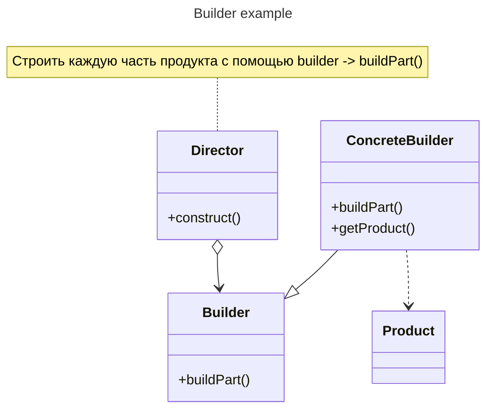

# Отчет Лабораторная работа 2

---

## Цель работы

Применение паттерна проектирования Builder (строитель)

## Задание

Разработать UML-диаграммы (диаграмму классов и диаграмму последовательности), и, с помощью паттерна "**Строитель**" решить следующую задачу.

**Задача.** Обеспечить контроль загрузки и готовности к отправлению автобусов и такси. Водитель такси и автобуса имеют права разной категории. Без водителя машина не поедет. Два водителя в одну машину сесть не могут. Без пассажиров машины не поедут. Есть лимит загрузки машин. Для автобуса - 30 человек. Для такси - 4 человека.

Есть разница между пассажирами автобуса и такси.

Для автобуса: три категории пассажиров:

- Взрослый
- Льготный
- Ребенок

Для всех разная стоимость билета.

Для такси:

- Взрослый
- Ребенок

Необходимо детское кресло.

## Результат

Диаграмма классов:



Диаграмма последовательности:

```mermaid
sequenceDiagram
	+aClient ->> aConcreteBuilder : new ConcreteBuilder
	John ->> Alice: Great!
	Alice -) John: See you later!
```

## Контрольные вопросы

1. В чем заключается разница между паттерном проектирования **"Абстрактная фабрика"** и **"Строитель"**?
2. Достоинства и недостатки паттернов проектирования **"Абстрактная фабрика"** и **"Строитель"**.