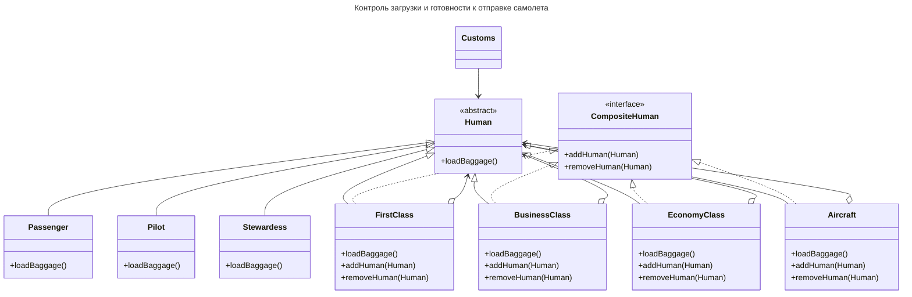

# Отчет Лабораторная работа 3

---

## Задание

Разработать UML-диграммы (диаграмму классов и диаграмму последовательности), и, с помощью паттерна **Composit** решить следующую задачу.

Обеспечить контроль загрузки и готовности к отправлению самолета.

В самолете присутствуют пилоты (2 человека), стюардессы (6 человек), пассажиры первого (макс. 10 человек), бизнес (макс. 20 человек), эконом (150 человек) классов. Пассажиры имеют багаж (от 5 до 60 кг). Бесплатно к провозу багажа допускается 35кг - бизнес класс, 20кг - эконом и без ограничения - первый класс.

Примитивный объект - пассажир, пилот - стюардесса. Составной объект - первый, бизнес и эконом классы.

Пилоты и стюардессы не могут иметь багажа.

Есть максимальная допустимая загрузка самолета багажом. При превышении - багаж снимается с рейса. Снять багаж можно только у пассажиров эконом класса.

В результате работы программ должна быть создана карта загрузки самолета с указанием перевеса багажа и информации о снятом с рейса багаже.

## Результат

**Диаграмма классов:**

**Диаграмма последовательности:**

```mermaid
sequenceDiagram
    participant Main as Main (Client)
    participant Aircraft as Aircraft
    participant FirstClass as FirstClass
    participant BusinessClass as BusinessClass
    participant EconomyClass as EconomyClass
    participant Passenger as Passenger
    participant Pilot as Pilot
    participant Stewardess as Stewardess
    
    Note over Main: Создание структуры самолета
    Main->>Aircraft: new Aircraft("Boeing 747", 5000)
    Main->>FirstClass: new FirstClass("Первый класс")
    Main->>BusinessClass: new BusinessClass("Бизнес класс")
    Main->>EconomyClass: new EconomyClass("Эконом класс")
    
    Note over Main: Добавление пилотов (2)
    Main->>Pilot: new Pilot("Пилот Иванов")
    Main->>Pilot: new Pilot("Пилот Петров")
    
    Note over Main: Добавление стюардесс (6)
    loop 6 раз
        Main->>Stewardess: new Stewardess(name)
    end
    
    Note over Main: Добавление пассажиров первого класса (10)
    loop 10 раз
        Main->>Passenger: new Passenger(name, "первый")
        Main->>FirstClass: addHuman(passenger)
        FirstClass-->>FirstClass: проверка лимита (10)
        FirstClass->>FirstClass: passengers.add(passenger)
    end
    
    Note over Main: Добавление пассажиров бизнес класса (20)
    loop 20 раз
        Main->>Passenger: new Passenger(name, "бизнес")
        Main->>BusinessClass: addHuman(passenger)
        BusinessClass-->>BusinessClass: проверка лимита (20)
        BusinessClass->>BusinessClass: passengers.add(passenger)
    end
    
    Note over Main: Добавление пассажиров эконом класса (150)
    loop 150 раз
        Main->>Passenger: new Passenger(name, "эконом")
        Main->>EconomyClass: addHuman(passenger)
        EconomyClass-->>EconomyClass: проверка лимита (150)
        EconomyClass->>EconomyClass: passengers.add(passenger)
    end
    
    Note over Main: Добавление секций в самолет
    Main->>Aircraft: addHuman(firstClass)
    Main->>Aircraft: addHuman(businessClass)
    Main->>Aircraft: addHuman(economyClass)
    
    Note over Main: Запуск процесса загрузки
    Main->>Aircraft: loadBaggage()
    
    rect rgb(200, 220, 240)
        Note over Aircraft: Начало загрузки багажа
        Aircraft->>FirstClass: loadBaggage()
        activate FirstClass
        
        loop по всем пассажирам первого класса
            FirstClass->>Passenger: loadBaggage()
            Passenger-->>FirstClass: вывод веса багажа
            FirstClass->>FirstClass: суммирование веса
        end
        
        FirstClass-->>Aircraft: общий вес первого класса
        deactivate FirstClass
        
        Aircraft->>BusinessClass: loadBaggage()
        activate BusinessClass
        
        loop по всем пассажирам бизнес класса
            BusinessClass->>Passenger: loadBaggage()
            Passenger-->>BusinessClass: вывод веса багажа
            
            alt вес > 35 кг (лимит)
                BusinessClass->>BusinessClass: расчет превышения
                BusinessClass-->>BusinessClass: вывод информации о превышении
            end
            
            BusinessClass->>BusinessClass: суммирование веса
        end
        
        BusinessClass-->>Aircraft: общий вес бизнес класса
        deactivate BusinessClass
        
        Aircraft->>EconomyClass: loadBaggage()
        activate EconomyClass
        
        loop по всем пассажирам эконом класса
            EconomyClass->>Passenger: loadBaggage()
            Passenger-->>EconomyClass: вывод веса багажа
            
            alt вес > 20 кг (лимит)
                EconomyClass->>EconomyClass: расчет превышения
                EconomyClass-->>EconomyClass: вывод информации о превышении
            end
            
            EconomyClass->>EconomyClass: суммирование веса
        end
        
        EconomyClass-->>Aircraft: общий вес эконом класса
        deactivate EconomyClass
    end
    
    rect rgb(240, 200, 200)
        Note over Aircraft: Проверка перегруза
        Aircraft->>Aircraft: расчет общего веса
        
        alt общий вес > 5000 кг (максимальная загрузка)
            Aircraft->>Aircraft: расчет перегруза
            Aircraft-->>Main: вывод информации о перегрузе
            
            Note over Aircraft: Поиск эконом класса для снятия багажа
            Aircraft->>EconomyClass: removeExcessBaggage(5000, totalWeight)
            activate EconomyClass
            
            EconomyClass->>EconomyClass: расчет необходимого снятия
            EconomyClass->>EconomyClass: сортировка пассажиров по весу
            
            loop пока перегруз > 0
                EconomyClass->>Passenger: getBaggageWeight()
                Passenger-->>EconomyClass: вес багажа
                
                alt вес > 20 кг
                    EconomyClass->>EconomyClass: расчет снимаемого веса
                    EconomyClass->>Passenger: setBaggageWeight(newWeight)
                    EconomyClass->>EconomyClass: removedBaggagePassengers.add(passenger)
                    EconomyClass-->>Aircraft: информация о снятом багаже
                end
            end
            
            EconomyClass-->>Aircraft: завершение снятия багажа
            deactivate EconomyClass
            
            Aircraft->>Aircraft: перерасчет общего веса
            
            Note over Aircraft: Формирование отчета
            Aircraft->>Aircraft: вывод информации о снятом багаже
            Aircraft-->>Main: итоговая карта загрузки
            
        else вес в пределах нормы
            Aircraft-->>Main: вывод информации о норме загрузки
        end
    end
    
    Note over Main: Готовность к отправке
    Main-->>Main: формирование итогового отчета
```

