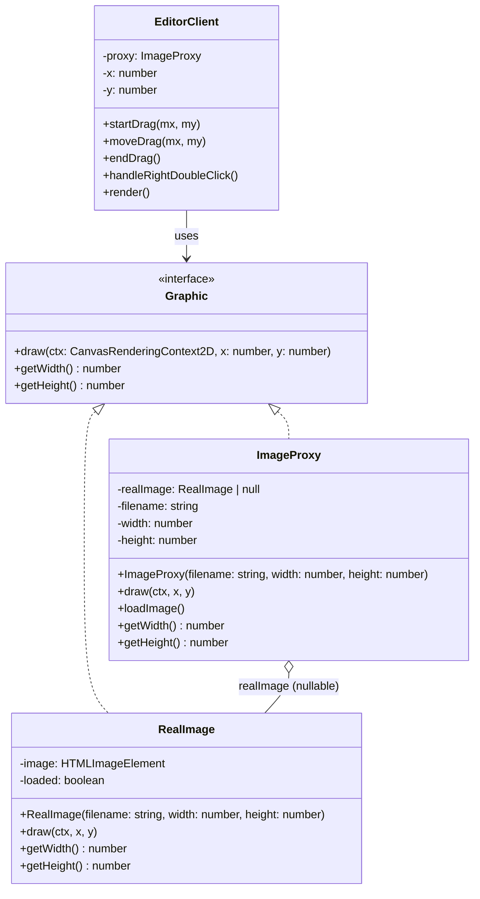
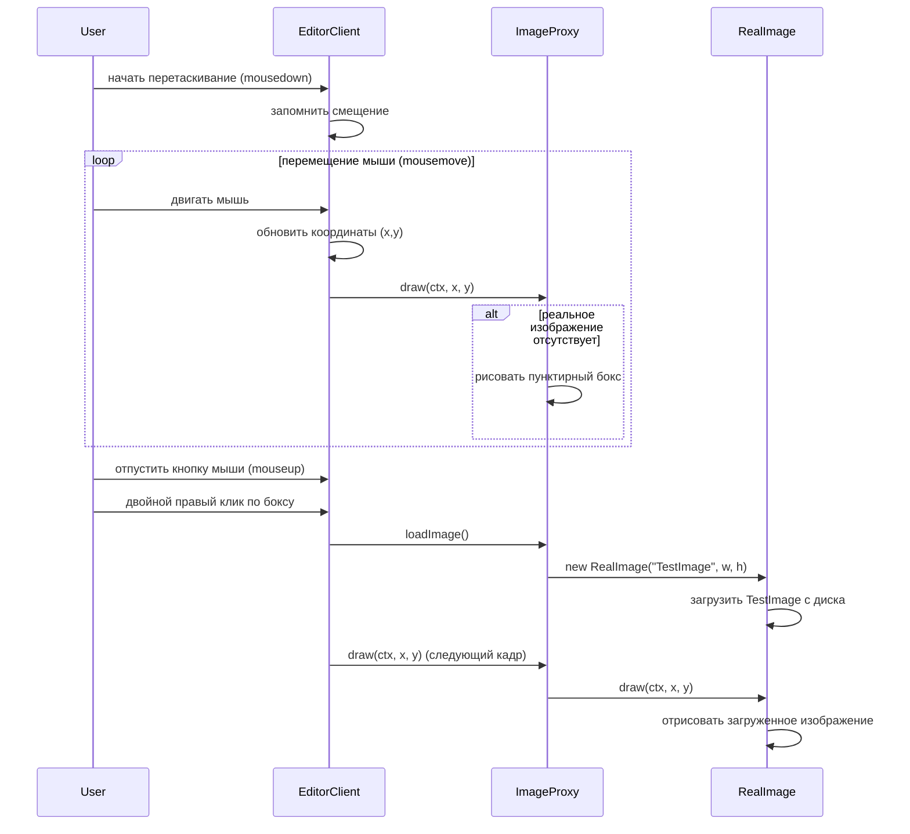

# Отчет Лабораторная работа 4

---

## Задание

Разработать UML-диаграмму (диаграмму классов и диаграмму последовательности), и, с помощью паттерна **"proxy"** решить следующую задачу.

Создать простейшую модель фрагмента графического редактора, позволяющую нарисовать на экране монитора бокс, имеющий размеры реального изображения, хранящегося на диске под именем `TestImage`. Используя паттерн **"proxy"** обеспечить свободное перемещение бокса с помощью **"мыши"** по экрану. При двойном нажатии на правую клавишу **"мыши"** обеспечить загрузку реального изображения в нарисованный бокс.

## Диаграмма классов

## Диаграмма последовательности

## Контрольные вопросы

1. Чем похожи и чем отличаются паттерны **Proxy**, **Adapter** и **Decorator**?

Все три паттерна - **структурные**, оборачивающие объект.

- **Proxy** - оборачивает объект, контролируя доступ к нему.
- **Adapter** - приводит чужой интерфейс к ожидаемому клиентом.
- **Decorator** - добавляет новые обязанности динамически, не меняя интерфейс.