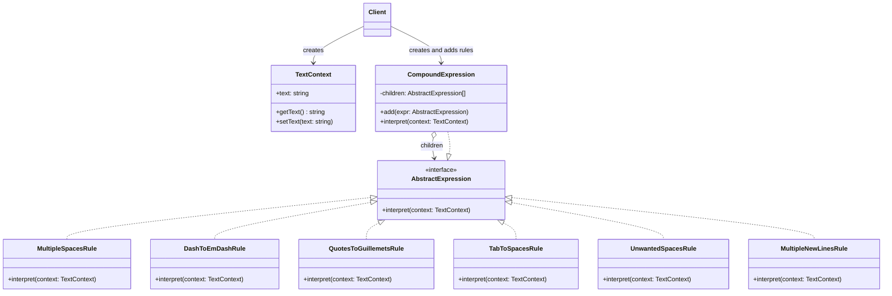
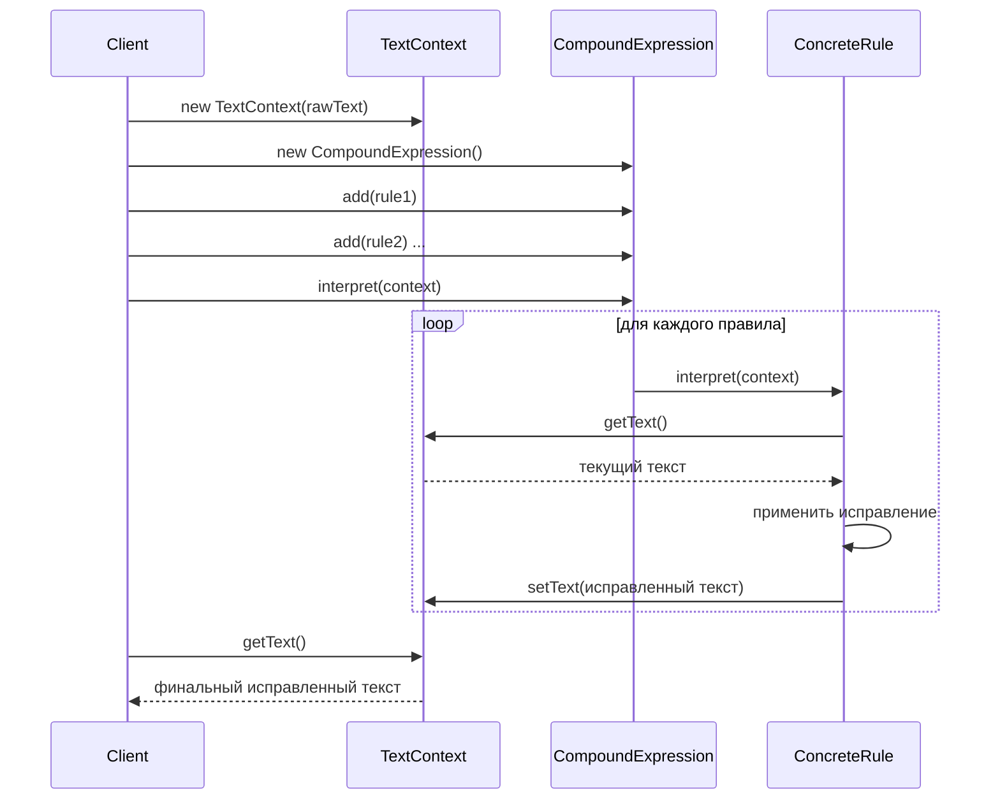

# Отчет Лабораторная работа 5

---

## Задание

Разработать UML-диаграммы (диаграмму классов и диаграмму последовательности), и, с помощью паттерна **"Interpreter"**, решить следующую задачу.

Создать простейший интерпретатор текстового редактора, позволяющий исправлять стандартные ошибки, допускаемые при подготовке обычных текстов.

Как правило, человек при наборе текста в программе **WORD** не обращает внимания на соблюдение правил структурного оформления текстов, что вызывает некоторые трудности при чистовой верстке.

Типичные структурные ошибки:

1. Множественные пробелы;
2. Использование дефиса вместо тире;
3. Использование в качестве кавычек символов "", тогда как стандартом является использование $""$;
4. Неправильное использование табуляторов;
5. Наличие "лишнего" пробела после открывающей скобки, перед закрывающей скобкой, перед запятой, перед точкой;
6. Наличие множественных символов перевода строки;

Разработать грамматику и иерархию классов. Используя паттерн **"Interpreter"**, провести синтаксический анализ текста и устранить перечисленные ошибки.

## Результат

**Диаграмма классов:**

**Диаграмма последовательности:**

## Контрольные вопросы

1. С помощью каких еще паттернов проектирования можно решить поставленную задачу?

Эту задачу можно также решить с помощью следующих паттернов:

- **Стратегия**. Можно определить семейство алгоритмов коррекции и динамически выбирать нужный набор.
- **Декоратор**. Можно обернуть чтение текста дополнительными преобразованиями, добавляя исправления без изменения интерфейса.
- **Цепочка обязанностей**. Можно выстроить цепочку обработчиков, где каждый будет проверять текст на свою ошибку и, при необходимости, исправлять, передавая результат следующему.