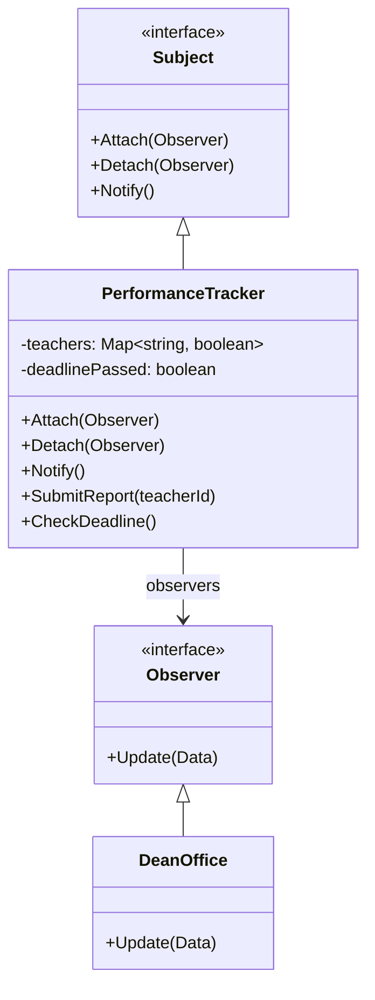
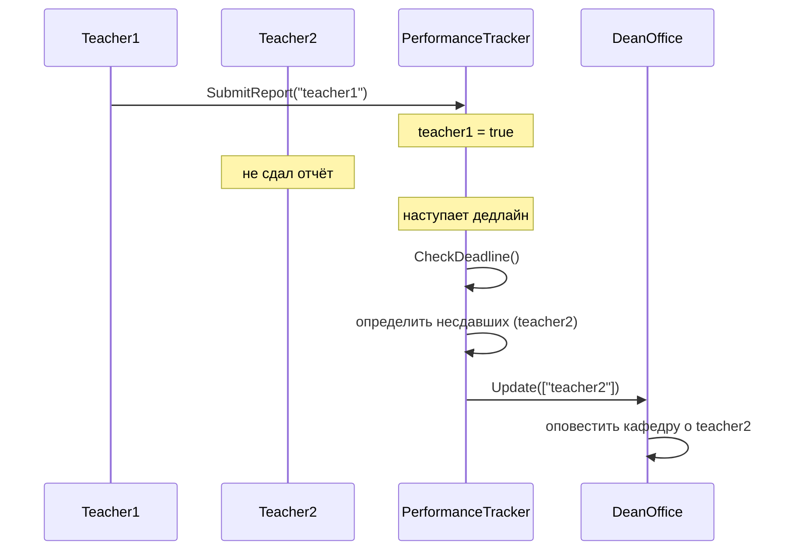

# Отчет Лабораторная работа 6

---

## Задача

Разработать UML-диаграммы (диаграмму классов и диаграмму последовательности), и, с помощью паттерна **"Observer"** решить следующую задачу.

Деканат отлеживает текущую успеваемость в группах факультета по одной из дисциплин. Преподаватели раз в неделю создают текущую успеваемость и размещают ее в базе данных. Если преподаватель вовремя не создал текущую успеваемость - деканат оповещает об этом кафедру.

## Результат

**Диаграмма классов:**

**Диаграмма последовательности:**

## Контрольные вопросы

1. С помощью каких еще паттернов проектирования можно решить поставленную задачу?

Эту задачу можно также решить с помощью паттерна **Цепочка обязанностей**: при проверке того, сдали ли преподаватели текущую успеваемость, можно гибко настроить последовательность обработки событий, вместо того, чтобы создавать централизованный список подписчиков.